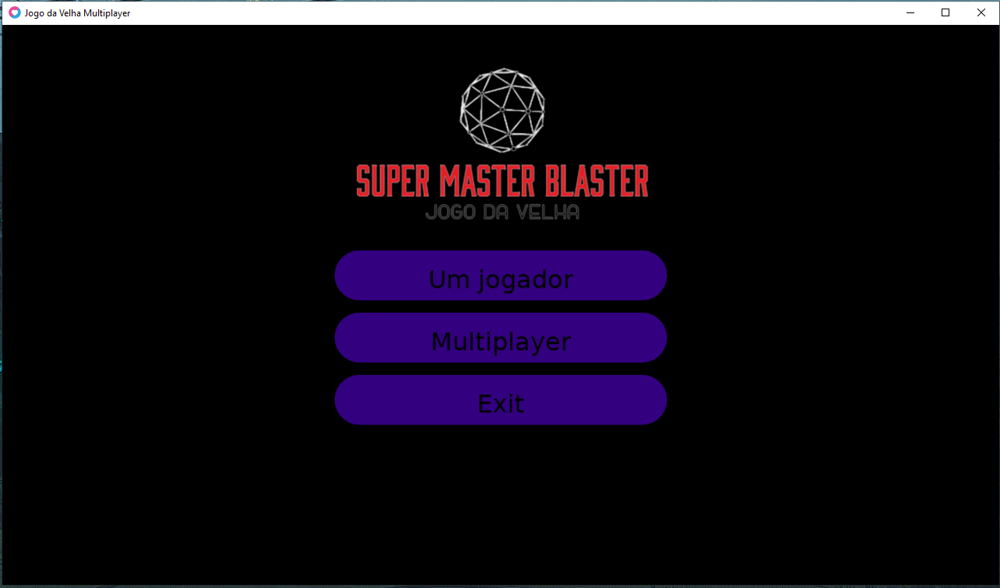
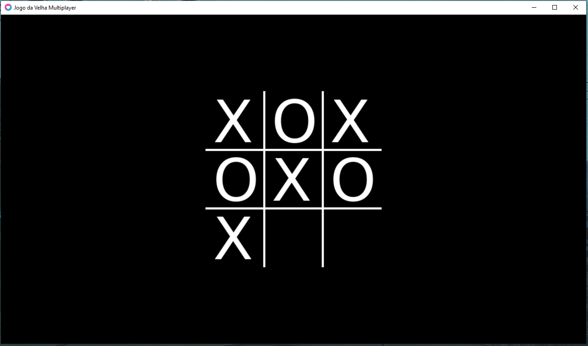
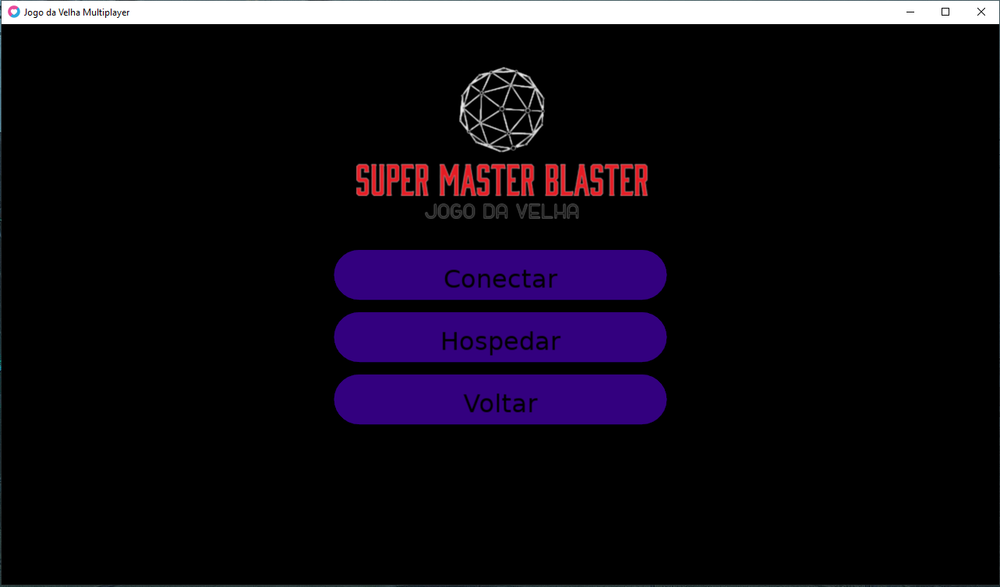
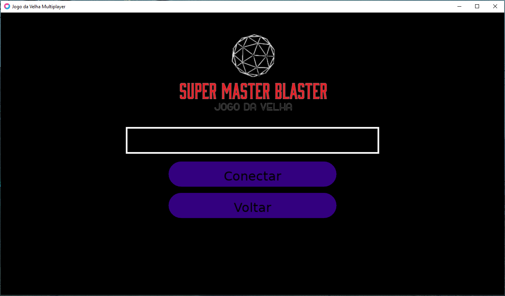

# **Jogo da velha multiplayer #01**

## Codificando [jogo da velha][wiki] multiplayer utilizando a Framework [LÖVE 2D][love2d] em equipe.
---

[wiki]:https://pt.wikipedia.org/wiki/Jogo_da_velha
[love2d]:https://love2d.org/

#### ...